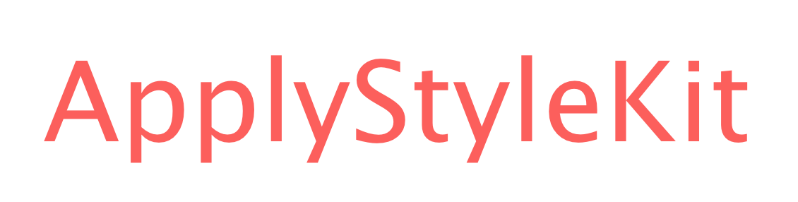

<div align="center" >
  
</div>

# ApplyStyleKit
[](https://app.bitrise.io/app/9d318dc7bad1f48a)
[](https://github.com/Carthage/Carthage)
[](https://cocoapods.org/pods/ApplyStyleKit)
[](http://cocoapods.org/pods/ApplyStyleKit)
[](http://cocoapods.org/pods/ApplyStyleKit)

ApplyStyleKit is a library that applies styles to UIKit using Swifty Method Chain.

Normally, when applying styles to UIView etc.,it is necessary to write propertyName and equal operator many times.

With ApplyStyleKit, you can comfortably apply style to your code.

Like this:
```swift
    sampleLabel.applyStyle
        .backgroundColor(.yellow)
        .text("sample label")
        .textAlignment(.center)
        .textColor(.green)
        .font(.boldSystemFont(ofSize: 30.0))
        .numberOfLines(0)
```

## Installation
### Requirements
- iOS 9.0 or later
- Swift 4.2
- Xcode 10

### Carthage
```
  github "shindyu/ApplyStyleKit"
```

### CocoaPods
```
target '<Your Target Name>' do
  pod 'ApplyStyleKit'
end
```

## Usage

```swift
import ApplyStyleKit

class ViewController: UIViewController {
    let sampleView = UIView()
    let sampleLabel = CustomLabel()

    override func viewDidLoad() {
        super.viewDidLoad()
        
        // Apply style
        sampleView.applyStyle
            .backgroundColor(.red)
            .alpha(0.5)

        // When applying to layer
        sampleView.layer.applyStyle
            .cornerRadius(10)
            .borderColor(.gray)
            .borderWidth(2)

        // Of course, you can apply it if you inherit UIView etc.
        sampleLabel.applyStyle
            .text("Of course, you can apply it if you inherit UIView etc.")
            .textAlignment(.center)
            .textColor(.green)
            .font(.boldSystemFont(ofSize: 30.0))
            .numberOfLines(0)
    }
}
```

### Advanced
You can also create your own applyStyleMethod.

To be able to define the extension, the access modifier of `base` which is a property of `StyleObject` is public.

example:
```swift
extension StyleObject where Base: UIView {
    @discardableResult func specialStyle() -> StyleObject {
        base.backgroundColor = .red
        base.layer.cornerRadius = 10
        return self
    }
}
```

## Support
QuartzCore
- ✅ CALayer

UIKit
- ✅ UIView
- ✅ UILabel
- ✅ UIButton
- ✅ UIImageView
- ✅ UISwitch
- ✅ UIControl
- ✅ UIStackView
- ✅ UISlider
- ✅ UITableView
- ✅ UICollectionView

## Basic policy
ApplyStyleKit intends to target methods with no return value and properties with setter.
Due to the nature of ApplyStyleKit, I think that returning types other than StyleObject should be avoided.
 
## Contributing
Please make an issue or pull request if you have any request.

Bug reports, Documentation, or tests, are always welcome as well!😂

## License
ApplyStyleKit is available as open source under the terms of the [MIT](https://github.com/shindyu/ApplyStyleKit/blob/master/LICENSE) License.
